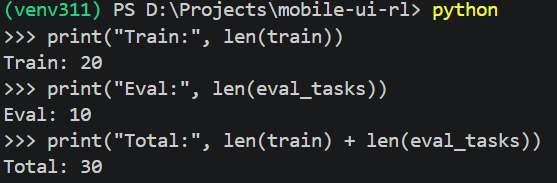
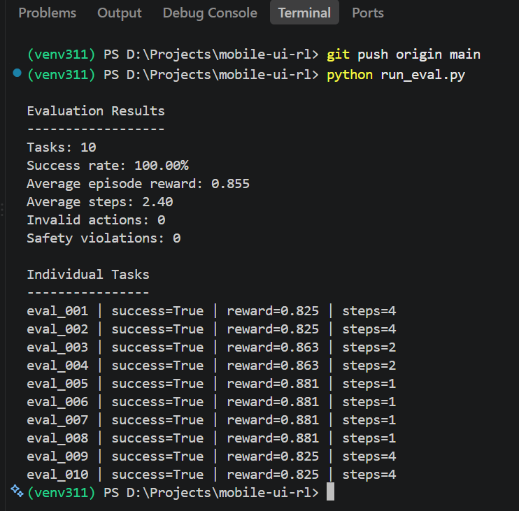

# Mobile UI RL Environment

A lightweight, symbolic Reinforcement Learning (RL) environment where an agent completes mobile UI tasks using structured actions (`tap`, `type`, `back`, and `finish`).

This project is a 24-hour prototype focused on building and testing the core RL environment loop:
`Task → State → Action → State Change → Reward → Goal Check`

It does not use a heavy Android emulator or train an actual RL model. The main objective was to engineer a robust, bug-free environment that handles states, actions, and rewards correctly.

---

## 📱 Core Concept

The mock application consists of four screens: **Home**, **Notes**, **Settings**, and **Profile**.

An agent receives a natural language task (e.g., *"Create a note titled 'Buy milk'"*) and must interact with the app to achieve that goal. 

For every action the agent takes, the environment:
1. Validates if the action is possible.
2. Updates the internal state.
3. Checks if the final task goal is met.
4. Calculates the reward or penalty.
5. Decides whether to continue or end the episode.

---

## 🏗️ Environment Architecture

### 1. State Space
Instead of raw pixels or screenshots, the environment uses a small, deterministic symbolic state. The state vector includes:
* **Current Screen:** `home`, `notes`, `settings`, or `profile`
* **App Data:** Saved notes and the current draft note content
* **System Toggles:** Focus mode and notification status
* **Episode Metrics:** Current step count, invalid actions, and safety violations

This keeps the environment lightweight while retaining all necessary data for transitions and goal verification.

### 2. Action Space
The agent navigates using four structured JSON actions:
* `tap(target)`: Interacts with a specific UI element.
* `type(target, text)`: Inputs text into a specific field.
* `back()`: Returns to the previous screen.
* `finish()`: Manually ends the episode.

If an agent attempts an impossible action (like tapping a `save` button while on the Home screen), the environment catches it as an invalid action, penalizes it, and continues without crashing.

### 3. Episode Termination
An episode ends under three conditions:
* **Goal Reached:** The requested task is successfully completed.
* **Agent Finishes:** The agent explicitly calls the `finish` action.
* **Timeout:** The episode hits the task's `max_steps` limit (preventing infinite loops).

---

## 🎯 Reward System

The reward system is carefully designed to encourage task completion while penalizing bad behavior.

### Sparse Rewards (Primary)
The main success signal is sparse. A task only receives the success reward (scaled 0 to 1) when the exact final goal is reached. Getting "closer" to the goal (e.g., opening the Notes app or typing text) yields zero success reward.

### Dense & Shaped Rewards
Smaller signals are used to guide behavior along the way:
* **Efficiency (Bonus):** Successful tasks receive a small bonus based on how few steps were used.
* **Invalid Actions (Penalty):** A negative reward is immediately applied for attempting actions that don't make sense on the current screen.
* **Safety Violations (Penalty):** A stronger negative reward is applied for explicitly unsafe behavior (like triggering a user logout).

### Preventing Reward Hacking
Reward shaping can lead to exploits. For instance, if the efficiency reward was granted regardless of the outcome, an agent might learn to instantly call `finish()` on step 1 to maximize efficiency points without actually doing the work. To prevent this, the efficiency component is **only** added after a successful task completion. 

---

## Dataset & Evaluation
### Dataset



**The Dataset** (`data/tasks.json`) contains 30 tasks total:
* 20 Training Tasks
* 10 Evaluation Tasks

### Evaluation Output


**The Evaluation Baseline** runs a deterministic heuristic script (`run_eval.py`). It uses predefined valid action patterns to navigate the environment. 
* *Note: The baseline currently achieves a 100% success rate. This is meant to validate that the environment mechanics, state transitions, and reward logic work perfectly. It is not evidence of a trained RL model.*

---

## 🧪 Testing

The project uses `pytest` for unit testing the environment. Currently, **13/13 tests pass**.

The test suite covers:
* Action creation and screen navigation
* Note creation workflows
* Invalid action catching
* Profile navigation and focus mode toggles
* Reward calculation and safety penalties

*(Debugging Example: Testing caught a bug where failed tasks were accidentally receiving an efficiency reward. I refactored the logic to ensure efficiency is only rewarded upon actual success.)*

---

## 🚀 Scaling & Future Integration

**Scaling to a Real Android Emulator:**
The symbolic state used in this prototype can be swapped out. To use a real device, the environment would hook into an Android Emulator, replacing the state space with Accessibility Trees (XML hierarchy), Screenshots, and OCR. Actions would map to real ADB (Android Debug Bridge) or Appium commands.

**Prime Intellect / Verifiers / PRIME-RL:**
The modular design makes this easy to plug into larger frameworks. A `load_environment()` function can be added to expose the environment to Verifiers. The existing 20/10 dataset split maps cleanly to evaluation pipelines, and PRIME-RL can eventually be used to train an LLM policy against this exact environment logic.

---

## ⚖️ Scope and Tradeoffs

Because this was a strict 24-hour prototype, explicit engineering tradeoffs were made to ensure a stable MVP:
* **Symbolic UI over Real Android:** I bypassed the heavy setup, rendering delays, and flakiness of an Android emulator to focus 100% on getting the RL logic right.
* **Small Dataset:** Hand-crafted 30 high-quality tasks rather than automating a massive, noisy dataset. 
* **Deterministic Baseline:** Used a heuristic script to test the environment rather than spending hours training a fragile baseline RL policy, which was out of scope.

---

## 💻 Quick Start

**1. Clone the repository**
```bash
git clone <repository-url>
cd mobile-ui-rl
```

**2. Create a virtual environment**
```bash
python -m venv venv311

# Windows PowerShell:
.\venv311\Scripts\Activate.ps1
# Mac/Linux:
source venv311/bin/activate
```

**3. Install the project**
```bash
pip install -e .
```

**4. Run test suite**
```bash
pytest
```

**5. Run the evaluation baseline**
```bash
python run_eval.py
```

## 📁 Project Structure

```text
mobile-ui-rl/
├── mobile_ui_env/
│   ├── __init__.py
│   ├── env.py
│   ├── state.py
│   ├── actions.py
│   ├── dataset.py
│   └── rubric.py
├── data/
│   └── tasks.json
├── tests/
│   ├── test_actions.py
│   ├── test_rewards.py
│   └── test_env.py
├── screenshots/
│   ├── datasize.png
│   └── evaluation.png
├── run_eval.py
├── pyproject.toml
├── README.md
└── AI_USAGE.md
```